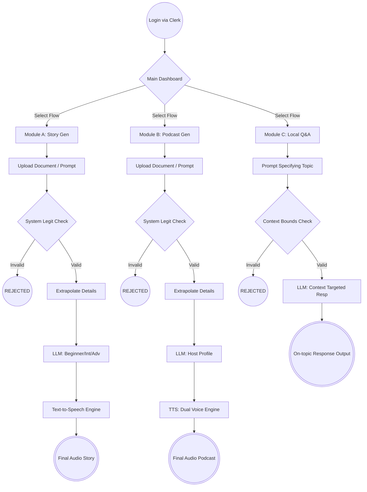

# 🔭 PaperLens

**PaperLens** is an AI-powered educational and research tool. It ingests user-provided content (either via direct prompt or PDF upload) and transforms that information into highly digestible, multimodal formats. The platform utilizes Large Language Models (LLMs) to ensure content validity before processing it into customized stories, two-speaker podcasts, or answering context-specific questions.

## 📑 Table of Contents
- [Core Scope](#core-scope)
- [System Architecture & Workflow](#system-architecture-workflow)
- [Tech Stack](#tech-stack)
- [Getting Started](#getting-started)

---

<a id="core-scope"></a>
## 🚀 Core Scope

The current MVP (Minimum Viable Product) for the hackathon focuses on three primary pillars of content transformation:

- **Adaptive Story Generation:** Translating documents into narratives tailored to different comprehension levels (Beginner, Intermediate, Advanced).
- **Podcast Generation:** Converting research into an audio discussion featuring a simulated "Host" and "Guest."
- **Context-Aware Q&A:** A localized chat interface that strictly answers questions based on the uploaded research paper, preventing irrelevant tangents.

---

<a id="system-architecture-workflow"></a>
## 🏗 System Architecture & Workflow

The application follows a linear authentication flow before branching into three parallel feature sets from the main dashboard.



### 1. Entry Protocol
- **Login:** User authentication layer via **Clerk** (Completed ✅).
- **Dashboard:** The central hub where the user selects their desired content transformation path.

### 2. Module A: Story Generation
- **Input:** The user either uploads a PDF or enters a text prompt.
- **Validation (LLM Check & Legit Check):** The system evaluates the input. If the content is deemed invalid or inappropriate ("No"), the process breaks.
- **Processing:** The system extracts the text from the valid source.
- **Generation:** An LLM generates a story based on the text. The user can dictate the complexity by selecting: *Beginner*, *Intermediate*, or *Advanced*.
- **Audio Conversion:** The generated text is passed through a Text-to-Speech (TTS) engine.
- **Output:** The final audio-story is generated and presented to the user.

### 3. Module B: Podcast Generation
- **Input:** PDF Upload or User Prompt.
- **Validation:** Similar to Module A, an "LLM Check / Legit Check" acts as a gatekeeper. Invalid inputs break the loop.
- **Processing:** Text is extracted from the approved input.
- **Generation:** The LLM structures the text into a conversational script featuring two personas: a Host and a Guest.
- **Audio Conversion:** The script is processed via TTS utilizing distinct voices for the Host and Guest.
- **Output:** The final audio podcast is generated.

### 4. Module C: Q/A (Question & Answer)
- **Input:** The user asks a specific question.
- **Validation (Context Check):** The system checks if the question is strictly related to the provided research paper/context.
  - *If No:* The process breaks (preventing hallucinations or off-topic usage).
  - *If Yes:* The system proceeds.
- **Output:** The LLM generates a targeted response based purely on the source material.

---

<a id="tech-stack"></a>
## 💻 Tech Stack

| Layer | Category | Technologies |
| :--- | :--- | :--- |
| **Frontend** | Framework | Next.js 16 (React 19) |
| **Frontend** | Styling | Tailwind CSS 4, Shadcn UI |
| **Frontend** | Animations | Framer Motion, GSAP, Lenis |
| **Frontend** | Authentication | Clerk |
| **Frontend** | AI Integration | Vercel AI SDK |
| **Frontend** | Utilities | Monaco Editor, Razorpay |
| **Backend** | Framework | FastAPI (Python) |
| **Backend** | Database | Motor (MongoDB), Asyncpg (PostgreSQL) |
| **Backend** | Document Processing| PyMuPDF |
| **Backend** | LLM Integrations | Groq, OpenAI, Gemini |

---

<a id="getting-started"></a>
## ⚙️ Getting Started

### Prerequisites
- Node.js (v18+)
- Python (3.10+)
- MongoDB / PostgreSQL Instances

### Frontend Setup
Navigate to the `frontend` directory and install dependencies:
```bash
cd frontend
npm install
npm run dev
```
The frontend will start on development port `6969` (as configured).

### Backend Setup
Navigate to the `backend` directory, set up your Python environment, and start the FastAPI server:
```bash
cd backend
python -m venv venv
# Windows:
venv\Scripts\activate
# Mac/Linux:
source venv/bin/activate

pip install -r requirements.txt
uvicorn main:app --reload
```
---
